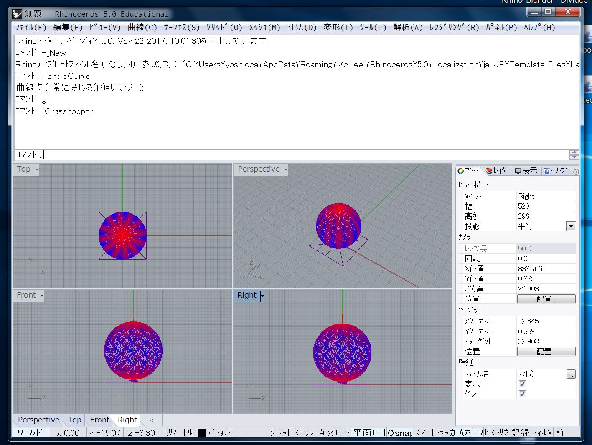

# gh-g-code-Veiwer  

金田さんの WS にて、パラメータをによる形状の変化を描画するスクリプトを書いた。  
金田さんは、一筆書き（ヘリカル）での、3Dプリントの可能性を研究している。  

[http://www.kanadas.com/program/2014/10/3d_python.html](http://www.kanadas.com/program/2014/10/3d_python.html)  

[http://dasyn.com/](http://dasyn.com/)  

  

座標だけでなく、エクストルーダの移動速度の制御を用いて模様を作るので、フィード値（F）を表現する必要がある。  
汎用の、スライサの描画であると、速度はわからないので、細かな表現がわかりにくい。  
gcode の文字列操作し、3D に描画する。  

### Result  

ビューワーの出力結果  

  

### 190218  

これを作ったのは、丸2年前くらい。  
ノードで書いてあった、文字列操作の部分を Python に書き換えました。  
